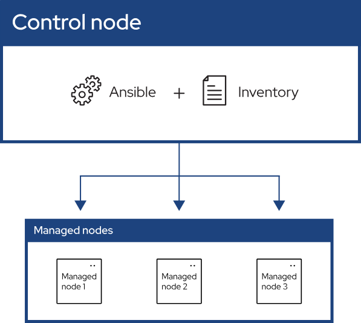

# Requirements
- Python >= 3.12
- Ansible == 2.15.11

# 개요
- Ansible은 오픈 소스 소프트웨어 자동화 플랫폼으로, 주로 IT 인프라의 프로비저닝, 구성 관리, 애플리케이션 배포 등에 사용됩니다. Red Hat에 의해 관리되며, Python으로 작성되었습니다.
- Ansible은 다음 세 가지로 구성되어 있습니다.
    - **Control Node** : 실제Ansible이 설치되어 Managed Node를 관리하는 노드
    - **Managed Node** : Control Node가 관리하는 원격 서버
    - **Inventory** : Managed Node의 호트스와 그룹을 정의하는 구성요소

### 주요 특징
1. **간단한 구성**: Ansible은 YAML (YAML Ain’t Markup Language)을 사용하여 인간이 읽을 수 있는 간단한 구성 파일을 기반으로 작동합니다. 이러한 파일을 '플레이북'이라고 부릅니다.
2. **에이전트리스**: 대상 서버에 별도의 에이전트를 설치할 필요가 없습니다. SSH와 같은 기존의 네트워크 프로토콜을 통해 작업을 실행합니다.
3. **멱등성**: 같은 명령을 여러 번 실행하더라도 동일한 결과를 보장합니다. 이는 설정이 반복적으로 적용되더라도 시스템 상태가 중복으로 변경되지 않음을 의미합니다.
4. **확장성**: 작은 규모의 프로젝트부터 대규모 인프라까지 다양한 환경에서 활용할 수 있습니다.

# 구성
## 인벤토리(Inventory)
- Inventory는 `.ini` 형식 또는 `.yaml` 형식으로 작성할 수 있습니다.
- Group을 기준으로 Host를 구분할 수 있으며 변수를 설정하여 Ansible Playbookpy에 활용할 수 있습니다.
- Inventory에 어떠한 그룹도 정의되지 않은 경우 Ansible에서 자동으로 `all` 과 `ungrouped` 그룹을 생성합니다.

### 주요 구성
1. **호스트**: 개별적으로 관리할 서버 또는 장치의 주소(예: IP 주소 또는 호스트명)입니다.
2. **그룹**: 관리해야 할 호스트들을 논리적으로 분류할 수 있게 해주는 기능입니다. 예를 들어, 웹 서버, 데이터베이스 서버 등과 같이 특정 역할을 수행하는 서버들을 그룹화할 수 있습니다.
3. **변수**: 각 호스트 또는 그룹에 대해 설정할 수 있는 변수를 정의할 수 있습니다. 이 변수들은 특정 서버나 그룹에 대한 구성을 동적으로 조정하는 데 사용됩니다.
- 기본 작성 예시(`.ini`)

    ```other
    mail.example.com
    
    [webservers] # Group Name
    foo.example.com # Host
    bar.example.com
    
    [dbservers]
    one.example.com
    two.example.com
    three.example.com
    ```

- 기본 작성 예시(`.yaml`)

    ```yaml
    ungrouped: # Default Group
      hosts:
        mail.example.com:
    webservers:
      hosts:
        foo.example.com:
        bar.example.com:
    dbservers:
      hosts:
        one.example.com:
        two.example.com:
        three.example.com:
    ```

### multiple group (parent/child group)

- Inventory에서 Gorup 간 parent/child 관계를 구성해 관리할 수 있습니다.
- parent/child 관계를 구성할 때 parent 그룹에 children 엔트리추가 후 하위 항목으로 child 그룹을 나열합니다.

```yaml
ungrouped:
  hosts:
    mail.example.com:
webservers:
  hosts:
    foo.example.com:
    bar.example.com:
dbservers:
  hosts:
    one.example.com:
    two.example.com:
    three.example.com:
atlanta:
  hosts:
    host1:
    host2:
  vars:
    ntp_server: ntp.atlanta.example.com
    proxy: proxy.atlanta.example.com
east:
  hosts:
    foo.example.com:
    one.example.com:
    two.example.com:
west:
  hosts:
    bar.example.com:
    three.example.com:
prod:
  children:
    east:
test:
  children:
    west:
```


### load order
- Ansible에서 inventory를 읽을 때 ASCII 순서대로 파일명을 읽습니다.
- Parent 그룹이 Child 그룹 보다 먼저 로드 될 경우 `Unable to parse /path/to/source_of_parent_groups as an inventory source`. 에러가 발생합니다.
- 올바른 로드 순서 예시

    ```yaml
    inventory/
      01-openstack.yml          # configure inventory plugin to get hosts from OpenStack cloud
      02-dynamic-inventory.py   # add additional hosts with dynamic inventory script
      03-on-prem                # add static hosts and groups
      04-groups-of-groups       # add parent groups
    ```


## 플레이북(Playbook)
- 플레이북(Playbook)은 구성 관리, 애플리케이션 배포, 서비스 오케스트레이션 등을 위해 사용되는 구성 스크립트입니다.
- YAML 형식으로 작성되어 있으며, 하나 이상의 '플레이'로 구성됩니다.
- 각 플레이는 특정 호스트 또는 호스트 그룹에 대해 수행할 작업을 정의합니다.

### 주요 구성
1. **플레이**: 특정 목적을 수행하는 일련의 작업을 포함하고 있으며, 어느 호스트에 적용될지를 지정합니다.
2. **태스크**: 각 태스크는 Ansible 모듈을 하나 이상 호출하며, 이 모듈들은 파일 복사, 패키지 설치, 사용자 생성과 같은 특정 작업을 실행합니다.
3. **변수**: 태스크에서 사용될 수 있는 변수를 정의하며, 이 변수들은 작업 실행 시에 구체적인 값을 제공합니다.
4. **핸들러**: 특정 태스크가 변경을 발생시켰을 때만 호출되는 태스크입니다. 예를 들어, 설정 파일이 변경되었을 때 서비스를 재시작하는 것과 같은 작업을 핸들러로 정의할 수 있습니다.
- **작성 예시**

    ```yaml
    ---
    - name: Configure webserver with Apache
      hosts: webservers
      become: yes
      tasks:
        - name: Install apache
          yum:
            name: httpd
            state: present
    
        - name: Write the apache index file
          copy:
            content: "<html>This is a test page</html>"
            dest: /var/www/html/index.html
    
        - name: Ensure apache is running (and enable it at boot)
          service:
            name: httpd
            state: started
            enabled: yes
    
    ```


### 명령어(Command)
- `ansible-playbook —check playbook.yaml`
    - Playbook을 실행하지만 수정은 발생하지 않습니다.
    - Playbook이 정상적으로 실행이 되는지 검증하기 위해 사용되며 실제 운영 환경 배포 전 테스트 용도로 사용할 수 있습니다.
- `ansible-lint playbook.yaml`
    - playbook 실행 전 syntax 에러나 다른 스크립트 상의 문제를 진단하기 위해 사용합니다.
    - `ansible-lint` 대신 `ansible-playbook --syntax-check` 도 사용 가능하다.

## Ansible Vault
- Ansible Vault는 중요한 데이터를 안전하게 저장하고 관리하기 위한 Ansible의 기능입니다.
- 비밀번호, API 키, 인증서와 같은 민감한 정보를 암호화하여 Playbook에서 안전하게 사용할 수 있습니다.

### 주요 기능
- **암호화 및 복호화**: 민감한 데이터를 파일 단위로 암호화하고 필요할 때 복호화합니다.
- **통합 관리**: 암호화된 데이터를 Playbook과 통합하여 사용할 수 있습니다.
- **안전한 비밀번호 관리**: 단일 비밀번호 또는 비밀번호 파일을 사용하여 암호화된 데이터를 보호합니다.

### 사용 방법
1. Vault 파일 생성   
   `ansible-vault create secret.yaml`

2. 기존 파일 암호화   
   `ansible-vault encrypt existing_file.yaml`

3. Vault 파일 편집   
   `ansbile-vault edit secret.yaml`

4. Vault 파일 복호화  
   `ansible-vault decrypt secret.yaml`

## Ansible Role
- Ansible Role은 복잡한 작업을 모듈화하고 재사용 할 수 있도록 도와주는 기능입니다.
- Role을 사용하면 프로젝트를 더 체계적으로 관리하기 쉽게 만들 수 있습니다.

### 기본 구조
```markdown
roles/
├── role_name/
│   ├── tasks/
│   │   └── main.yml
│   ├── handlers/
│   │   └── main.yml
│   ├── files/
│   ├── templates/
│   ├── vars/
│   │   └── main.yml
│   ├── defaults/
│   │   └── main.yml
│   ├── meta/
│   │   └── main.yml
│   ├── library/
│   └── module_utils/
```

- **tasks/**: Role에서 실행할 작업을 정의합니다. main.yml 파일이 주로 사용됩니다.
- **handlers/**: 핸들러를 정의합니다. 핸들러는 특정 작업이 변경될 때 실행됩니다.
- **files/**: 배포할 정적 파일을 저장합니다.
- **templates/**: Jinja2 템플릿 파일을 저장합니다.
- **vars/**: Role에서 사용할 변수들을 정의합니다.
- **defaults/**: Role의 기본 변수들을 정의합니다.
- **meta/**: Role에 대한 메타데이터를 정의합니다. 다른 Role에 대한 의존성을 지정할 수 있습니다.
- **library/**: 사용자 정의 모듈을 저장합니다.
- **module_utils/**: Role에서 사용하는 모듈 유틸리티를 저장합니다.

# 참조
- [Ansible 공식 문서](https://docs.ansible.com/ansible/latest/getting_started/index.html)