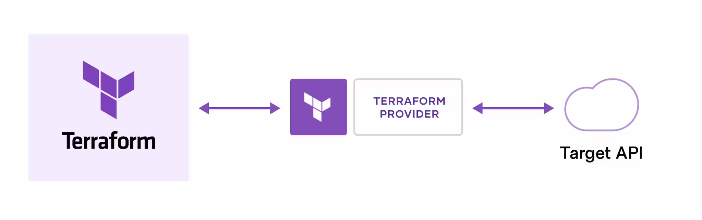

----
# 개요
- Terraform은  HashiCorp에 의해 개발된 오픈 소스 인프라스트럭처 코드(IaC) 도구로, 클라우드 서비스, 온프레미스 리소스 등 다양한 인프라를 구성하고 관리하는 데 사용됩니다. 
- Cloud Native 전환을 위한 필수 IaC(Infrastructure as Code) 서비스/플랫폼으로 특정 CSP(Cloud Service Provider)에 Lock-In 되는 것을 회피하고, Multi Cloud를 활용한 서비스 구성을 가능하게 합니다.

## 구성
1. **Provider**
   - Provider는 Terraform이 인프라 리소스를 생성, 관리, 조작할 수 있도록 하는 플러그인입니다. 
   - 각 클라우드 제공업체(AWS, Google Cloud, Azure 등) 또는 서비스(예: GitHub, Kubernetes)에는 특정 Provider가 있어 해당 서비스의 API와 Terraform 사이의 연결 역할을 합니다.
   ```hcl
   provider "aws" {
     region = "us-west-2"
   }
   ```

2. **Resource**
   - Resource는 Terraform에서 관리하는 기본 요소입니다. 
   - 클라우드 인프라 내의 한 구성 요소(예: 가상 머신, 네트워크 인터페이스, IP 주소 등)를 나타냅니다.
   ```hcl
   resource "aws_instance" "example" {
     ami           = "ami-0c55b159cbfafe1f0"
     instance_type = "t2.micro"
   }
   ```

3. **Output**
   - Output 변수는 Terraform 모듈에서 계산된 데이터를 외부로 출력하는데 사용됩니다. 
   - 모듈 간에 데이터를 공유하거나, Terraform 실행 후 외부에서 참조할 수 있는 중요 정보(예: 서버 IP 주소)를 제공하는데 유용합니다.
   ```hcl
   output "ip" {
      value = aws_instance.example.public_ip
   }
   ```

4. **Backend**
   - Backend는 Terraform의 상태 파일을 저장하는 방법을 정의합니다. 
   - Terraform 상태는 인프라의 현재 상태를 추적하는 파일이며, 이 파일을 통해 Terraform은 계획과 실제 리소스의 동기화를 유지합니다. 
   - Backend는 로컬 파일 시스템, 원격 저장소, 클라우드 서비스 등 다양한 옵션을 지원하여, 팀에서 상태를 공유하고 협업할 수 있게 돕습니다.
   ```hcl
   terraform {
     backend "s3" {
      bucket = "my-terraform-state"
      key    = "network/terraform.tfstate"
      region = "us-west-2"
     }
   }
    ```

5. **Module**
   - Module은 Terraform 코드를 패키지로 구성하는 방법입니다. 
   - 모듈은 재사용 가능한 코드 블록을 만들어 다른 Terraform 프로젝트에서 재사용할 수 있습니다.
    ```hcl
    module "vpc" {
      source = "terraform-aws-modules/vpc/aws"
      version = "2.77.0"
      name = "my-vpc"
      cidr = "10.0.0.0/16"
      azs = ["us-west-2a", "us-west-2b", "us-west-2c"]
      private_subnets = ["10.0.1.0/24", "10.0.2.0/24", "10.0.3.0/24"]
      public_subnets = ["10.0.101.0/24", "10.0.102.0/24", "10.0.103.0/24"]
      enable_nat_gateway = true
      enable_vpn_gateway = true
    }
    ```

6. **Remote State**
   - Remote State는 Terraform 상태 파일을 원격 데이터 저장소에 저장하는 것을 의미합니다.
   - 상태 파일은 실제 인프라의 구성과 동기화 상태를 유지하는 중요한 정보를 포함하고 있습니다.

## 동작 방식
- Terraform을 사용하여 인프라를 관리하는 기본적인 워크플로우는 크게 Write, Plan, apply 세 단계로 나뉩니다.
1. **Write**
   - 이 단계에서는 인프라를 코드로 정의합니다. 
   - Terraform 구성 파일(.tf 파일)에 인프라 리소스를 선언적으로 기술합니다.
    ```hcl
    provider "aws" {
        region = "us-west-2"
    }

    resource "aws_instance" "example" {
      ami           = "ami-0c55b159cbfafe1f0"
      instance_type = "t2.micro"

      tags = {
        Name = "example-instance"
      }
    }
    ```

2. **Plan**
   - `terraform plan` 명령어를 사용하여 작성된 코드를 기반으로 Terraform이 어떤 변경을 수행할 것인지 미리 확인할 수 있습니다. 
   - 이 단계에서는 실제 리소스를 변경하지 않고, 변경 사항의 요약을 출력합니다.

3. **Apply**
   - terraform apply 명령어를 사용하여 실제 인프라에 변경 사항을 적용합니다. 
   - 이 명령어를 실행하면 Terraform은 plan 단계에서 계산한 변경 사항을 기반으로 리소스를 생성, 수정, 삭제합니다.

# 참조
- [Terraform을 활용한 네이버 클라우드 플랫폼 IaC(Infrastructure as Code) 적용하기](https://d2.naver.com/helloworld/3612055)
- [Official Terraform Document](https://developer.hashicorp.com/terraform/intro)